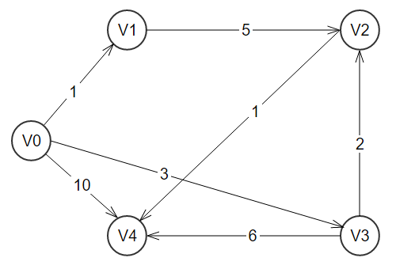
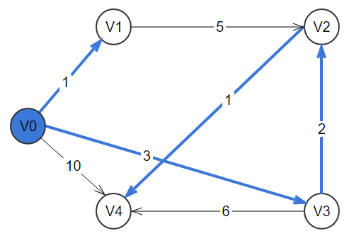

# Dijkstra Algorithm

This program offers a simple implementation of the [Dijkstra Algorithm](https://en.wikipedia.org/wiki/Dijkstra%27s_algorithm) for finding the shortest path between nodes in a graph.

The Makefile can be used to facilitate compiling the program, you can call it by running `nmake` from the Visual Studio tools.

You can call the program with:
```
dijkstra <filename>
```

Where you should pass a file representing the connections of the graph. In the folder `examples` there are two sample files that can be used to help understand how the program works and how the input file should be formatted.

The file ex1.txt contains the following text:
```
-1  1 -1  3 10
-1 -1  5 -1 -1
-1 -1 -1 -1  1
-1 -1  2 -1  6
-1 -1 -1 -1 -1
```

This numbers represent the costs from moving to a node from another where -1 indicates that there is no connection in that direction (cost infinite). The table bellow shows better the relation between the nodes given by this file.
<table>
  <tr>
    <th id="cost" scope="colgroup" colspan="6">Cost of moving from-to node</td>
  </tr>
  <tr>
    <th id="from" headers="cost" scope="col" rowspan="2" >From Node</td>
    <th id="to" headers="cost" scope="colgroup" colspan="5">To node</td>
  </tr>
  <tr>
    <td headers="to">V0</td>
    <td headers="to">V1</td>
    <td headers="to">V2</td>
    <td headers="to">V3</td>
    <td headers="to">V4</td>
  </tr>
  
  <tr>
    <td headers="from" style="text-align:center">V0</td>
    <td headers="to"  >&#8734</td>
    <td headers="to"  >    1 </td>
    <td headers="to"  >&#8734</td>
    <td headers="to"  >    3 </td>
    <td headers="to"  >   10 </td>
  </tr>

  <tr>
    <td headers="from" style="text-align:center">V1</td>
    <td headers="to"  >&#8734</td>
    <td headers="to"  >&#8734</td>
    <td headers="to"  >    5 </td>
    <td headers="to"  >&#8734</td>
    <td headers="to"  >&#8734</td>
  </tr>

  <tr>
    <td headers="from" style="text-align:center">V2</td>
    <td headers="to"  >&#8734</td>
    <td headers="to"  >&#8734</td>
    <td headers="to"  >&#8734</td>
    <td headers="to"  >&#8734</td>
    <td headers="to"  >    1 </td>
  </tr>

  <tr>
    <td headers="from" style="text-align:center">V3</td>
    <td headers="to"  >&#8734</td>
    <td headers="to"  >&#8734</td>
    <td headers="to"  >    2 </td>
    <td headers="to"  >&#8734</td>
    <td headers="to"  >    6 </td>
  </tr>

  <tr>
    <td headers="from" style="text-align:center">V4</td>
    <td headers="to"  >&#8734</td>
    <td headers="to"  >&#8734</td>
    <td headers="to"  >&#8734</td>
    <td headers="to"  >&#8734</td>
    <td headers="to"  >&#8734</td>
  </tr>
</table>

This values can be converted into the following graph representation:



The algorithm implemented in this program will ask for a starting vertice and calculate the minimun distance needed to get to the last node defined. Calling the program for the example `ex1.txt` will result in:
```
> dijkstra examples\ex1.txt

      V0   V1   V2   V3   V4
V0 |  -1    1   -1    3   10  |
V1 |  -1   -1    5   -1   -1  |
V2 |  -1   -1   -1   -1    1  |
V3 |  -1   -1    2   -1    6  |
V4 |  -1   -1   -1   -1   -1  |

Qual e o vertice de origem da arvore (0-4): 0
=========Arvore de Saida=========

Vertice de origem - V0
{V0->V1} - custo de V0 a V1= 1
{V0->V3} - custo de V0 a V3= 3
{V2->V4} - custo de V0 a V4= 6
{V3->V2} - custo de V0 a V2= 5
```

In this example the starting vertice was choosen to be V0, you can see the results showing the costs of moving from V0 to the destination V4 and also the constructed tree used to find the path. The resulting tree can be seen in the image bellow.



For a complete list of the graphs and all the possible trees constructed for the two examples you can check the [docs page](docs). 