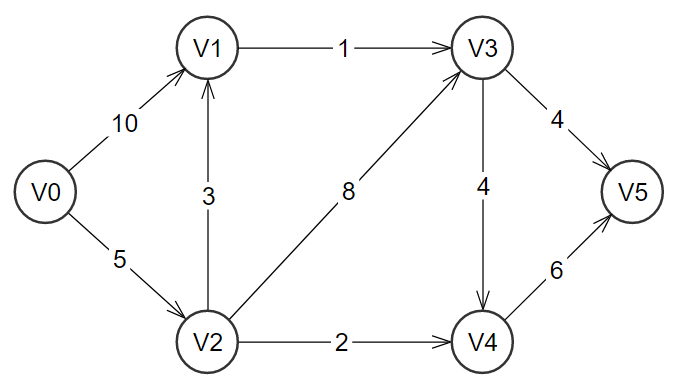

# Detailed examples

## Example 1
This file can be found at `examples\ex1.txt`, it's contents are:
```
-1  1 -1  3 10
-1 -1  5 -1 -1
-1 -1 -1 -1  1
-1 -1  2 -1  6
-1 -1 -1 -1 -1
```

The equivalent table of connections for this set of numbers is:
<table>
  <tr>
    <th id="cost" scope="colgroup" colspan="6">Cost of moving from-to node</td>
  </tr>
  <tr>
    <th id="from" headers="cost" scope="col" rowspan="2" >From Node</td>
    <th id="to" headers="cost" scope="colgroup" colspan="5">To node</td>
  </tr>
  <tr>
    <td headers="to">V0</td>
    <td headers="to">V1</td>
    <td headers="to">V2</td>
    <td headers="to">V3</td>
    <td headers="to">V4</td>
  </tr>
  
  <tr>
    <td headers="from" style="text-align:center">V0</td>
    <td headers="to"  >&#8734</td>
    <td headers="to"  >    1 </td>
    <td headers="to"  >&#8734</td>
    <td headers="to"  >    3 </td>
    <td headers="to"  >   10 </td>
  </tr>

  <tr>
    <td headers="from" style="text-align:center">V1</td>
    <td headers="to"  >&#8734</td>
    <td headers="to"  >&#8734</td>
    <td headers="to"  >    5 </td>
    <td headers="to"  >&#8734</td>
    <td headers="to"  >&#8734</td>
  </tr>

  <tr>
    <td headers="from" style="text-align:center">V2</td>
    <td headers="to"  >&#8734</td>
    <td headers="to"  >&#8734</td>
    <td headers="to"  >&#8734</td>
    <td headers="to"  >&#8734</td>
    <td headers="to"  >    1 </td>
  </tr>

  <tr>
    <td headers="from" style="text-align:center">V3</td>
    <td headers="to"  >&#8734</td>
    <td headers="to"  >&#8734</td>
    <td headers="to"  >    2 </td>
    <td headers="to"  >&#8734</td>
    <td headers="to"  >    6 </td>
  </tr>

  <tr>
    <td headers="from" style="text-align:center">V4</td>
    <td headers="to"  >&#8734</td>
    <td headers="to"  >&#8734</td>
    <td headers="to"  >&#8734</td>
    <td headers="to"  >&#8734</td>
    <td headers="to"  >&#8734</td>
  </tr>
</table>

This is equivalent to the following graph representation.


By running this example in the program you can choose from what node the search will begin, where the destination is the last node (in this case V4). Bellow you will find the resulting graph representation of the trees found for each possible starting node:
 + Starting from V0:

 
 
 + Starting from V1:

 

 + Starting from V2:

 

 + Starting from V3:

 

 + Starting from V4:

 


## Example 2
This file can be found at `examples\ex2.txt`, it's contents are:
```
-1 10  5 -1 -1 -1
-1 -1 -1  1 -1 -1
-1  3 -1  8  2 -1
-1 -1 -1 -1  4  4
-1 -1 -1 -1 -1  6
-1 -1 -1 -1 -1 -1
```

The equivalent table of connections for this set of numbers is:
<table>
  <tr>
    <th id="cost" scope="colgroup" colspan="7">Cost of moving from-to node</td>
  </tr>
  <tr>
    <th id="from" headers="cost" scope="col" rowspan="2" >From Node</td>
    <th id="to" headers="cost" scope="colgroup" colspan="6">To node</td>
  </tr>
  <tr>
    <td headers="to">V0</td>
    <td headers="to">V1</td>
    <td headers="to">V2</td>
    <td headers="to">V3</td>
    <td headers="to">V4</td>
    <td headers="to">V5</td>
  </tr>
  
  <tr>
    <td headers="from" style="text-align:center">V0</td>
    <td headers="to"  >&#8734</td>
    <td headers="to"  >   10 </td>
    <td headers="to"  >    5 </td>
    <td headers="to"  >&#8734</td>
    <td headers="to"  >&#8734</td>
    <td headers="to"  >&#8734</td>
  </tr>

  <tr>
    <td headers="from" style="text-align:center">V1</td>
    <td headers="to"  >&#8734</td>
    <td headers="to"  >&#8734</td>
    <td headers="to"  >&#8734</td>
    <td headers="to"  >    1 </td>
    <td headers="to"  >&#8734</td>
    <td headers="to"  >&#8734</td>
  </tr>

  <tr>
    <td headers="from" style="text-align:center">V2</td>
    <td headers="to"  >&#8734</td>
    <td headers="to"  >    3 </td>
    <td headers="to"  >&#8734</td>
    <td headers="to"  >    8 </td>
    <td headers="to"  >    2 </td>
    <td headers="to"  >&#8734</td>
  </tr>

  <tr>
    <td headers="from" style="text-align:center">V3</td>
    <td headers="to"  >&#8734</td>
    <td headers="to"  >&#8734</td>
    <td headers="to"  >&#8734</td>
    <td headers="to"  >&#8734</td>
    <td headers="to"  >    4 </td>
    <td headers="to"  >    4 </td>
  </tr>

  <tr>
    <td headers="from" style="text-align:center">V4</td>
    <td headers="to"  >&#8734</td>
    <td headers="to"  >&#8734</td>
    <td headers="to"  >&#8734</td>
    <td headers="to"  >&#8734</td>
    <td headers="to"  >&#8734</td>
    <td headers="to"  >    6 </td>
  </tr>

  <tr>
    <td headers="from" style="text-align:center">V5</td>
    <td headers="to"  >&#8734</td>
    <td headers="to"  >&#8734</td>
    <td headers="to"  >&#8734</td>
    <td headers="to"  >&#8734</td>
    <td headers="to"  >&#8734</td>
    <td headers="to"  >&#8734</td>
  </tr>
</table>

This is equivalent to the following graph representation.



By running this example in the program you can choose from what node the search will begin, where the destination is the last node (in this case V5). Bellow you will find the resulting graph representation of the trees found for each possible starting node:
 + Starting from V0:

 
 
 + Starting from V1:

 

 + Starting from V2:

 

 + Starting from V3:

 

 + Starting from V4:

 

 + Starting from V5:

 
